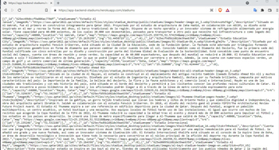

# CURSO TÉCNICO #5: INTEGRADOR

## Actividades:

### Node.js - Especificaciones

Actividad #1: Inicializar proyecto tanto de express como en github, definir scripts en package.json, definir rutas y config de conexión a BD Mongodb. Configurar .gitignore, credenciales sensibles en .env.

Actividad #2: Programación de los endpoints para un CRUD 

-   GET :: /resources ---> Trae un array con todos los resources.
    
-   GET :: /resources/:id ---> Trae el resource con la id especificada.
    
-   POST :: /resources ---> Crea un solo resource a la base de datos. Recibe datos por body. Verificar la entrada con Joi.
    
-   DELETE :: /resources/:id ---> Borra un elemento de la base de datos.
    
-   PATCH :: /resources/:id ---> Edita un resource con los datos enviados en body. Verificar body con Joi.

Respuesta:

aplicacion Node express desplegada en heroku:
### 1 https://app-backend-stadiums.herokuapp.com/stadiums

### 2   -> * Aplicaion WEB.

### 3   -> * Aplicaion movil.

